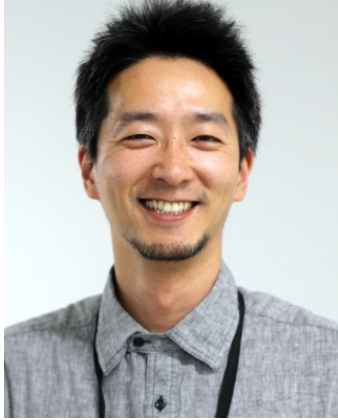

#
## Biography

{ width="150" align=left}

Researcher / Software Engineer with extensive knowledge of **audio signal processing**.
I joined Yamaha Corporation after I received Ph.D. in Engineering from Nara Institute of Science and Technology, 2010.
Since joining Yamaha Corporation, I have contributed to applications and services from both research and engineering perspectives. 
As a researcher, I have in-depth knowledge and experience mainly in the fields of acoustic signal processing and statistics/machine learning.
And in addition, I have diverse skills as an engineer, which are extensive experience in real-time audio signal processing, embedded system implementation, backend and frontend implementation for web systems, machine learning service deployment, and mobile application implementation.

## Research Themes
- Source separation based on microphone array and machine learning
- Music signal anslysis based on machine learning 
- Expert's operation modeling based on machine learning
- Distributed microphone array systems for new-generation multimedia 
- Musical noise analysis based on higher-order statistics
- Signal processing for biomechanics

## Research keywords
- Speech enhancement / Signal extraction
    - Microphone array or sensor array signal processing
    - Musical noise control for nonlinear signal processing
    - Nonnegative Matrix Factorization
    - Sparse representation
    - Independent Component Analysis or its extension
- Machine Learning
    - Modeling of expert's operation for audio equipments
    - Audio effect parameter estimation based on neural network

## Socil Activities
- Belongs to:
    - [IEEE](https://www.ieee.org)/[SPS](https://signalprocessingsociety.org/), [ASJ](https://acoustics.jp/), [JSAI](https://www.ai-gakkai.or.jp)
- Reiviewer:
    - [IEEE](https://www.ieee.org), [Signal Processing](https://www.journals.elsevier.com/signal-processing), [IEICE](https://www.ieice.org/eng_r/index.html), [ASJ](https://acoustics.jp/)

## Skills
- Programming/Implementation
    - C/C++, Python, Swift, Kotlin, C#, R, JavaScript, Rust, bash, VST, Max/MSP, PHP, SQL, nodejs, x86/x86_64, ARM
- Server/Embeded
    - Debian, Yocto, Linux From Scracth, Jenkins, docker, Kubernetes, RPi

## Career
:material-office-building: Researcher & Software Engineer at Yamaha Corporation, 2010

:material-school: Ph.D. Eng in Computer Science, 2010,
    - [Nara Institute of Sciene and Technolog (NAIST)](http://www.naist.jp/en/)

:material-school: M.E. in Computer Science, 2007
    - [Nara Institute of Science and Technology (NAIST)](http://www.naist.jp/en/)

:material-school: B.E. in Computer Science, 2005
    - Himeji Institute of Technology

## Hobbies/Passion
:material-music: - playing acousitc guitar, more than 20 years experience

:material-baby-face-outline: - Parenting

:material-code-braces: - programming

:material-baseball: - playing/watching baseball

:material-math-integral: - mathematics

:material-hammer-screwdriver: - DIY/IoT

## Contact
- :fontawesome-brands-twitter:{ .twitter } twitter - [@yuu0t](https://twitter.com/yuu0t)

